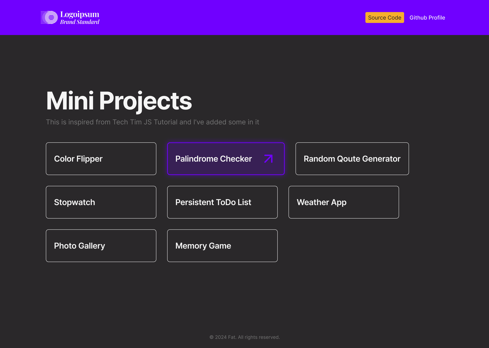

# Acknowledgement

### [JS Mini Projects Live Site](https://fahatmah.github.io/mini_projects_js/index.html)

## [5 Mini JavaScript Projects - For Beginners](https://youtu.be/2ml4x0rO1PQ?si=lDB4SwVObgeViabg)

Inspired from Tech with Tim

## [Mini Projects Design](https://www.figma.com/design/PGSj95sAIZs7LX6mqMOp2h/Mini-Projects-Design?node-id=0-1&t=gpfCRjS8Xy9LU3Nd-1)

I designed each project to make it at least presentable and to build up
confidence in creating a website with good and intuitive design.

